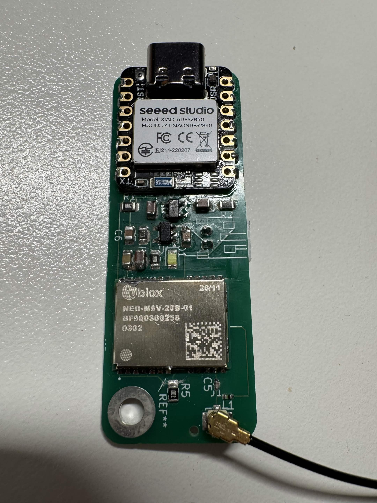

# open-race
gnss module collecting track data

v1 pcb

# todo
- when writing software
    - make battery charging 0ma
    - so no dual charger conflict

# oopsies
- On v1 safeboot is pull uped with reset on same resistor, not necessary this causes mdoule to boot in safeboot mode and breaks everything.